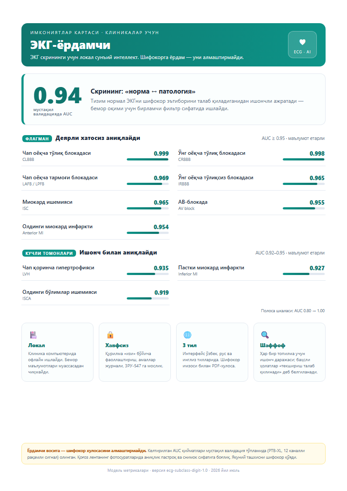

<p align="center">
  
</p>

<h1 align="center">Yurak.AI</h1>

<p align="center"><b>On-premise AI assistant for ECG screening in clinics.</b><br/>
Local · explainable · privacy-first — an assistant for physicians, not a replacement.</p>

<p align="center"></p>

---

## What it does

- 📷 **Photo → diagnosis.** Digitizes a photo/scan of a paper ECG and reconstructs the 12 leads — no new hardware required.
- 🏷️ **23 diagnostic conditions.** Bundle-branch blocks, myocardial infarction, ischemia, hypertrophy and more, each with a confidence score.
- 🔍 **Explainable AI.** An "where the model looked" map (occlusion) lets the physician verify each finding.
- 📄 **One-click report.** Trilingual (Uzbek / Russian / English) signed PDF with clinic logo and QR.
- 🔒 **Fully offline.** Patient data never leaves the clinic (compliant with Uzbekistan data-locality law, ZRU-547).

## Model performance

Macro-AUC **0.92** across 23 conditions on an independent test set. Selected per-class AUC:

| Condition | AUC | | Condition | AUC |
|---|---|---|---|---|
| Complete RBBB | **0.998** | | AV block | **0.957** |
| Complete LBBB | **0.997** | | Anterior MI | **0.946** |
| Posterior MI | **0.986** | | RV hypertrophy | **0.949** |
| Fascicular block | **0.967** | | LV hypertrophy | **0.928** |
| Ischemia | **0.964** | | Inferior MI | **0.921** |

> Metrics are measured on a clean digital validation set (PTB-XL). Accuracy on photographs of paper ECG tape is lower and depends on image quality. The final diagnosis is always made by the physician.

## Tech stack

**Frontend (this repository):** React · TypeScript · Vite · Tailwind CSS · i18next (uz/ru/en, dark theme).
**Backend (not public):** Python · FastAPI · ONNX Runtime · ReportLab.

```bash
cd frontend
npm install
npm run dev      # development
npm run build    # production build → frontend/dist
```

## Repository scope

> This public repository contains the **web frontend only**.
> The ML models, the ECG digitization pipeline, the training code, and the datasets are **proprietary** and are intentionally **not** included.

## Disclaimer

Yurak.AI is an **assistive tool**. It does **not** replace a physician's conclusion; the final diagnosis is made by the doctor.

## Contact

📧 b.umidkhonov@gmail.com
